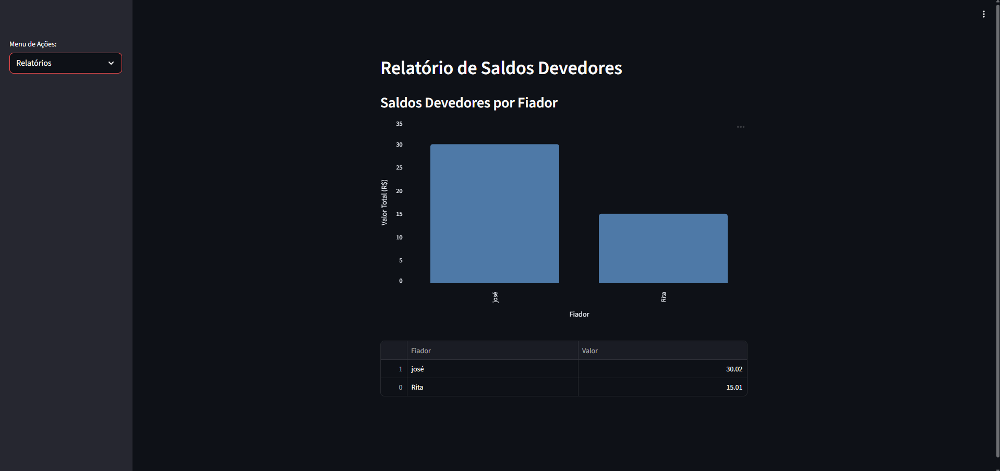

# 📊 Gerenciador de Fiados

Uma aplicação web simples e intuitiva para controle de vendas fiadas — idealizada para substituir os tradicionais cadernos de anotações em pequenos comércios, como a padaria do meu pai.

> ✅ Desenvolvido com **Python**, **Streamlit** e armazenamento em **Excel**.

---

## 📷 Demonstração

| Adicionar Venda | Relatório de Fiadores | Quitar Dívida |
|-----------------|-----------------------|---------------|
|  |  |  |

---

## 🚀 Funcionalidades

- 🔐 **Autenticação de Administrador**
- ➕ **Cadastro de Vendas Fiadas**: nome, valor e data
- 📈 **Visualização de Gráficos**: relatório de saldo por fiador
- ✔️ **Quitação de Dívidas**
- 💾 Armazenamento dos dados em **Excel**

---

## 🛠️ Tecnologias Utilizadas

- **[Python](https://www.python.org/)**
- **[Streamlit](https://streamlit.io/)** – para construção da interface web
- **Pandas** – manipulação de dados
- **Excel (.xlsx)** – como banco de dados local

---

## 📁 Estrutura do Projeto

-   📂 Gerenciador-de-Fiados/
    │
    ├── 📄 app.py                # Código principal da aplicação
    ├── 📁 dados/                # Arquivos Excel usados como "banco de dados"
    ├── 📄 requirements.txt      # Dependências do projeto
    ├── 📄 README.md             # Este arquivo
    └── 📁 imagens/              # Screenshots do sistema

## 📌 Futuras Melhorias

- 🗃️ Integração com banco de dados (ex: SQLite, PostgreSQL)

- 📱 Responsividade para dispositivos móveis

- 🧾 Histórico de pagamento por fiador

- 📤 Exportação de relatórios em PDF

---

## 🙋‍♂️ Autor
- Desenvolvido por Lucas Nascimento 👨‍💻
- Estudante de Engenharia da Computação | Desenvolvedor Full Stack

- 🔗 LinkedIn • 🐙 GitHub

---

## 🧪 Como Executar o Projeto Localmente

1. Clone o repositório:

```bash
git clone https://github.com/Lucas-Nascimentto/Gerenciador-de-Fiados.git
cd Gerenciador-de-Fiados
